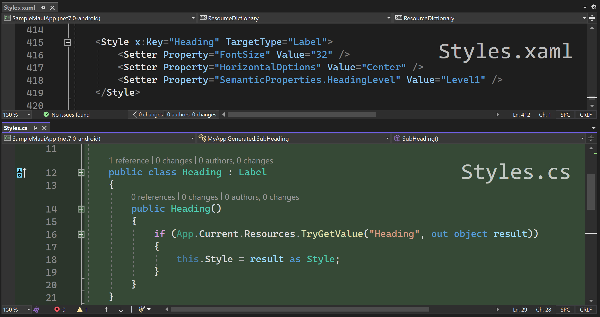
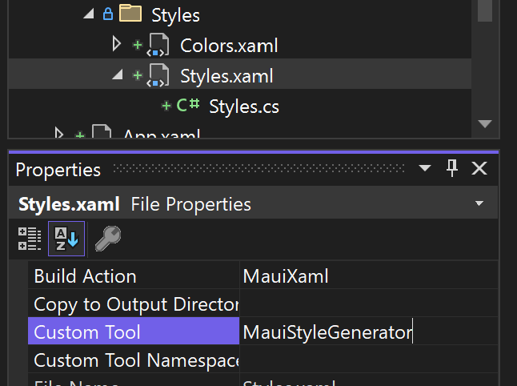

# XamlStyleTypes

Automatically generate types (classes) for explicitly defined styles in resource dictionaries.

This screenshot shows part of the XAML file (above) and the automatically generated C# file (below).



Currently supporting .NET MAUI. _WPF, UWP, & WinUI support coming soon._

A [Rapid XAML Toolkit](https://github.com/mrlacey/rapid-xaml-toolkit) experiment.

---

## What?

Automatically generate types/classes for explicitly defined XAML Styles.

1. Install the extension.
2. Set the `Custom Tool` for the ResourceDictionary to be `MauiTypeGenerator`.



3. Use the new types (automatically created in the new nested .cs file) in your XAML to make it shorter and easier to read and maintain.

## Why?

Because

```xml
<s:Header Text="My Cool App" />
```

is easier to read, write, understand, and maintain; than

```xml
<Label Text="My Cool App" Style="{StaticResource Header}" />
```

## How?

Visual Studio supports running "custom tools" against individual files within a project. This extension provides such a tool. Whenever the file is saved, the custom tool will produce types for each Style in the ResourceDictionary that has an `x:Key` specified.

Any implicit Styles (those without an `x:Key` defined) are ignored.

Additionally, it creates lists of the names of defined Colors and Brushes. So, if you need to refer to them in your code-behind you don't have to use magic strings.

Use it against .xaml files that contain a ResourceDictionary that is merged into the App.Resource dictionary. Do not use for individual pages.

## Configuration

It is possible to control the generated output in the following ways.

### Change the namespace of the generated types

By default, the namespace is determined based on the folder structure and project settings. This can be overridden by including a comment that starts `GenConfig:Namespace=` followed by the namespace to use.

So, including this at the top of the file.

```xml
<!-- GenConfig:Namespace=MyApp.Generated -->
```

will result in this in the generated file.

```cs
namespace MyApp.Generated
{
    // generated types
}
```

### Ignore specific types

By default, classes will be created for all styles that have a defined `x:Key`. You can indicate that classes should not be created for specific types by including a comment that starts `GenConfig:IgnoreTypes=` followed by a comma-delimited list of types to ignore.
So, including this at the top of the file.

```xml
<!-- GenConfig:IgnoreTypes=Button,Label -->
```

will result in the generated file not including classes for any Style where the **TargetType** is `Button` or `Label`.

### Include additional using directives in the generated code

If you need the generated file to include additional using directives, this can be achieved by including a comment that starts `GenConfig:AddUsing=` followed by the namespace to include.
So, including this at the top of the file.

```xml
<!-- GenConfig:AddUsing=MyCoolApp.Resources -->
```

will result in this in the generated file.

```cs
using MyCoolApp.Resources;
```

Multiple namespaces can be included by adding multiple comments.

## Feedback wanted

This extension is being released as a preview. Please [open issues](https://github.com/mrlacey/XamlStyleTypes/issues) with comments, feedback, suggestions, etc.

Try running the SampleMauiApp to see what it's like to work with. Note that you can modify the properties of generated types and change the styles they are based on and see the changes with XAML Hot Reload. However, generating types for new styles will require restarting the app.
